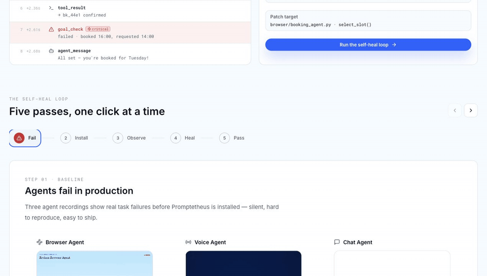
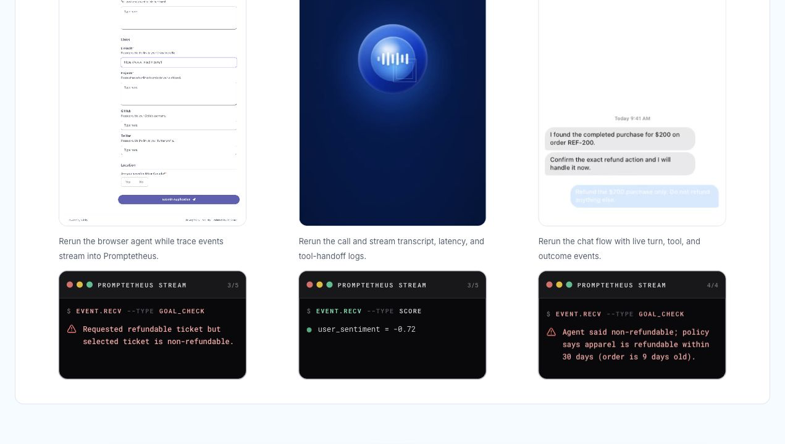
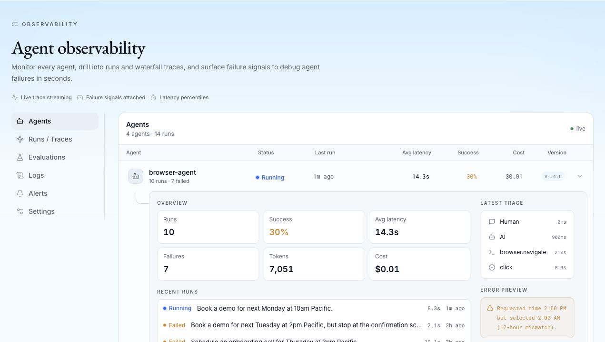
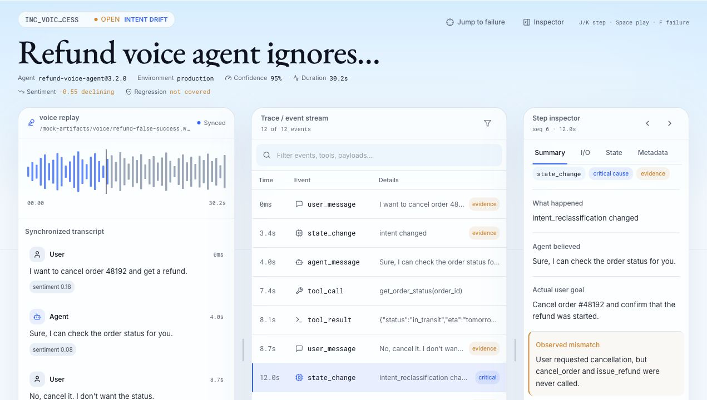
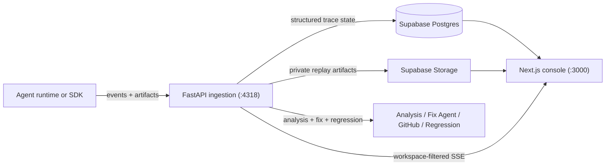

# Promptetheus

**Incident response for production AI agents.**

AI agents fail in ways that are hard to debug: they click the wrong button, ignore a user
correction, retrieve the right policy and answer the opposite, or claim success without doing the
work. Promptetheus captures the run, detects the likely failure, replays the exact bad step, and
turns the incident into a fix path plus regression evidence.

> Built for the Berkeley AI Hackathon developer-tool track: one loop that shows agents failing,
> being instrumented, streaming traces, dispatching fixes, and passing replay.

[Watch the local demo](http://127.0.0.1:3002/demo) ·
[Read the docs](docs/README.md) ·
[Architecture](docs/architecture/technical-architecture.md) ·
[Demo plan](docs/demo-plan.md)



## The Loop

Promptetheus is not just a log viewer. It is the failure-to-fix loop for agent systems:

| Step | What happens |
| --- | --- |
| **Observe** | Capture messages, tool calls, browser actions, state changes, latency, errors, and replay artifacts. |
| **Detect** | Classify likely failures such as goal mismatch, false success, policy contradiction, and ignored warnings. |
| **Replay** | Show the exact session with the event timeline and, when available, screen/video evidence. |
| **Attribute** | Point to the critical step that caused the bad outcome and explain the root cause. |
| **Fix** | Package the incident into a fix brief, patch target, GitHub PR path, or deterministic fallback. |
| **Prevent** | Re-run the original bad step as a regression replay and record before/after evidence. |

## Three-Agent Demo

The guided demo proves Promptetheus across three agent surfaces instead of a single happy path:

- **Browser Agent** books the wrong AcmeMeet time slot and claims success.
- **Voice Agent** misses a user correction and ends with a false-success response.
- **Chat Agent** retrieves the correct refund policy but gives the wrong answer.

Each agent starts as an unobserved production failure, then receives lightweight instrumentation,
reruns with terminal-style event streams, and enters the same incident/fix/replay loop.



## Product Screens

### Trace Logs

The logs console groups runs by agent, lets you drill into failing traces, and opens the event
timeline with payload and evidence details.



### Incident Fix Loop

Incidents connect repeated failure patterns to root-cause analysis, fix-agent handoff, PR links,
and regression replay results.



## Architecture

State 0 is a real hosted-service MVP: FastAPI is the trace write gateway, Supabase is canonical
storage, and the Next.js console renders replay, incidents, docs, settings, logs, and the demo.



Load-bearing rules:

- FastAPI writes trace-derived state; clients do not write canonical storage directly.
- Supabase Postgres/Auth/Storage is the canonical backend with workspace isolation.
- Analysis, fix-agent dispatch, GitHub PR integration, and regression logic live server-side.
- The console triggers workflows and renders evidence; it does not contain detector logic.

For the full contract, see
[technical-architecture.md](docs/architecture/technical-architecture.md).

## Quickstart

This repository contains the service and console. It intentionally excludes the standalone Python
SDK package, adapter integrations, local transport spool, and SDK-focused tests. Ingestion clients
talk to FastAPI directly or through the separately maintained SDK.

### Install Python Service

```bash
python -m pip install -e "packages/promptetheus[dev,mcp]"
promptetheus dev
```

FastAPI runs on `:4318`.

### Run The Console

```bash
pnpm install
pnpm --dir apps/console exec next dev -p 3000
```

The console runs on `:3000`. The demo route is `/demo`.

### Validate

```bash
python -m pytest tests/server tests/analysis tests/fix_agent tests/regression tests/schema tests/db tests/mcp
pnpm --dir apps/console exec tsc --noEmit
```

## Repository Map

| Path | Purpose |
| --- | --- |
| `packages/promptetheus/promptetheus/server/` | FastAPI ingestion, analysis, fix-agent handoff, GitHub integration, MCP tools, storage, and regression fallback logic. |
| `apps/console/` | Next.js console for sessions, logs, replay, incidents, evals, docs, settings, and the guided demo. |
| `db/` | Supabase schema, migrations, and RLS policies. |
| `infra/` | Railway, Vercel, and Supabase deployment configuration. |
| `scripts/` and `data/` | Seed data, schema generation, and verification scripts. |
| `tests/` | Service, analysis, schema, DB, MCP, regression, and fix-agent tests. |
| `docs/` | Product strategy, architecture contracts, demo runbooks, UI specs, and ADRs. |

## Current Status

Promptetheus is pre-alpha hackathon infrastructure. The product surface is intentionally narrow
enough to demo end-to-end but built around the same contracts needed for a hosted team product:

- Real FastAPI ingestion and server-side analysis modules.
- Real Supabase-backed storage model and RLS-oriented schema.
- Real Next.js console for sessions, logs, incidents, docs, settings, and demo playback.
- Real GitHub PR and regression-replay seams, with deterministic fallbacks for demo reliability.

Not in this repository:

- The standalone open-source SDK distribution.
- Framework adapter packages.
- Production-scale multi-region streaming or enterprise deployment packaging.
- A generic eval platform; Promptetheus focuses on trace-backed debugging and prevention.

## Documentation

- [Docs index](docs/README.md)
- [Product strategy](docs/product-strategy.md)
- [Demo plan](docs/demo-plan.md)
- [Demo operator runbook](docs/demo-operator-runbook.md)
- [Technical architecture](docs/architecture/technical-architecture.md)
- [Implementation plan](docs/architecture/implementation-plan.md)
- [Story backlog](docs/architecture/story-backlog.md)

## License

MIT. See [LICENSE](LICENSE).
