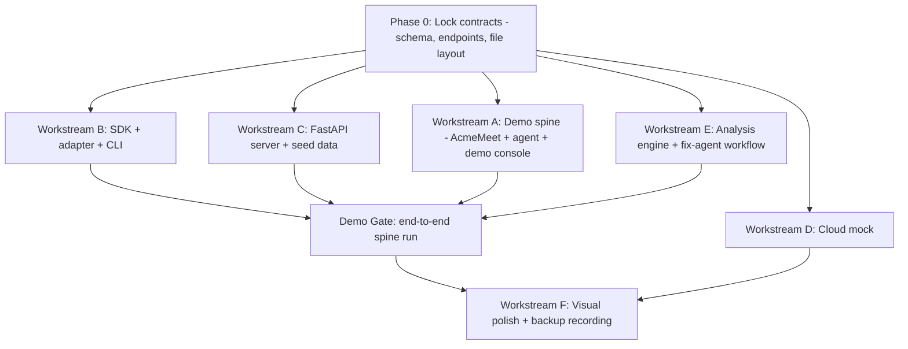

# Implementation Plan

How we build the architecture in [technical-architecture.md](technical-architecture.md), in what order, and how the work parallelizes across agents.

Scope discipline: this plan builds **State 0** from [staged-scope.md](staged-scope.md) — the demo spine is real, everything else is mocked behind swap-ready seams. State 1 wire-up items are picked off only after the demo gate passes.

## Locked Decisions

| Decision | Choice | Notes |
| --- | --- | --- |
| Python version | Develop on 3.14, declare `requires-python = ">=3.12"` | FastAPI supports 3.14 (requires Pydantic v2 2.12+); Playwright 1.60+ works. Fall back to 3.13 if any dep fails to install |
| Python tooling | `uv` for env + publishing | |
| Console tooling | Node + `pnpm`, Next.js + Tailwind + shadcn/ui | |
| LLM provider | DeepSeek via `.env.local` (`PROMPTETHEUS_LLM_*` vars) | Provider-agnostic client; cheap, swappable. Canned fallbacks remain the demo-safe path |
| PyPI name | `promptetheus` — confirmed available (June 2026) | Claim early by publishing a minimal `0.0.1` stub; there is no reserve mechanism |
| License | MIT | Required for the open-source adoption story |
| Replay video format | `.webm` (Playwright native) | No ffmpeg transcode step. Chrome plays webm natively in `<video>`. All docs reference `replay.webm` |
| Replay time sync | Recording-start timestamp emitted as an event; `event_time_map` offsets are relative to it | Keeps the failure freeze-frame frame-accurate |
| Live stream path | Console subscribes directly to FastAPI `:4318/api/stream` (CORS preconfigured) | Do not proxy SSE through Next.js dev server |
| Git hygiene | `.promptetheus/` gitignored; seed data regenerable via `scripts/seed.py` | |

## Principle: Contract First, Then Fan Out

The single biggest risk with parallel agents is drift between the SDK, the ingestion server, and the console. So the build starts with a short serial phase that locks the contracts, then fans out into the six workstreams from [linear-execution-plan.md](../linear-execution-plan.md).



## Phase 0 — Lock Contracts (Hour 0-2, serial)

Deliverables, in this order:

1. **Event schema**: write `schema.py` TypedDicts and the matching `schema.ts` zod definitions for all 11 event types. Include `seq`, `timestamp`, `session_id` envelope and the `replay_artifact.event_time_map`.
2. **Ingestion API**: freeze the 9-endpoint table in [technical-architecture.md](technical-architecture.md#ingestion-api-contract) — paths, request/response bodies, error shapes.
3. **File layout**: freeze the `.promptetheus/` structure.
4. **Repo skeleton**: monorepo folders (`packages/`, `apps/console/`, `agents/`, `scripts/`) with placeholder packages so every agent can clone and start.

Nothing else starts until this lands. Any later schema change must update both the Python and zod definitions in the same change.

## Phase 1 — Fan Out (Hour 2-12)

Per the hour-by-hour breakdown in [build-plan.md](../build-plan.md):

- **Workstream C (first to be load-bearing):** FastAPI server with all endpoints + SSE, persisting to `.promptetheus/`. Until it exists, other workstreams develop against seeded fixture files matching the storage contract.
- **Workstream B:** SDK with local transport (HTTP + file-write fallback), Playwright adapter, cloud transport stub, `promptetheus dev` CLI spawning both servers.
- **Workstream A:** AcmeMeet page with stable selectors and the timezone-warning behavior; scripted failure agent; side-by-side demo console consuming the SSE stream.
- **Workstream D (independent, lowest risk):** Cloud mock pages — pure UI against fixture data, no backend dependencies.
- **Workstream E:** analysis engine — rule detectors first (deterministic, demo-safe), then LLM classification and fix-brief generation with canned fallbacks for the primary session.

Integration checkpoints during fan-out:

- **Checkpoint 1 (≈ Hour 5):** SDK → FastAPI → file store round-trip works; console can list sessions.
- **Checkpoint 2 (≈ Hour 9):** live SSE stream renders in the demo console while the scripted agent runs.
- **Checkpoint 3 (≈ Hour 12):** replay view plays the recorded video synced to the timeline.

## Phase 2 — Demo Gate (Hour 12-20)

The gate from [linear-execution-plan.md](../linear-execution-plan.md) must pass end to end before any new feature work:

```text
1. promptetheus dev
2. Run scripted browser agent -> fails on AcmeMeet
3. Replay artifact appears
4. Failure evidence lights up (labels + critical step)
5. Incident detail opens
6. Fix-agent PR preview appears
7. Regression replay shows 12/12 fail -> 10/12 pass + 2 confirm
```

If the gate breaks, all agents stop feature work and fix the spine. Remaining Phase 2 work: incident grouping over seeded data, fix generator, PR preview card, regression replay panel.

## Phase 3 — Polish & Backup (Hour 20-24)

- Visual system pass over shared components (Workstream F takes ownership of shared UI only after core flows stabilize).
- Seed data review: the inbox must look like production, not a test fixture.
- Record the backup demo video and capture Devpost screenshots.
- Dry-run the 3-minute pitch from [demo-plan.md](../demo-plan.md) twice.

## Build vs. Leverage Decisions

| Need | Decision | Rationale |
| --- | --- | --- |
| Trace instrumentation client | **Build** (thin SDK) | Our event model (browser actions, replay artifacts, goal checks) doesn't exist elsewhere; the SDK is small. See the LangSmith analysis in [technical-architecture.md](technical-architecture.md#prior-art-why-not-build-on-the-langsmith-sdk) |
| Instrumentation ergonomics | **Borrow** from LangSmith SDK | `@traceable` / wrapper patterns, background batching, local spooling are proven designs (MIT licensed) |
| Browser automation | **Leverage** Playwright | Native video recording, deterministic selectors, Python API |
| Ingestion/storage | **Build** (FastAPI + files) | 9 endpoints over JSONL files is less work than adapting any existing backend |
| Console UI | **Leverage** Next.js + Tailwind + shadcn/ui | Standard stack, fastest path to production-grade feel |
| Failure detection | **Build** (rules + LLM) | This is the differentiated product; nothing off-the-shelf does behavioral agent failure detection |
| LangChain/LangSmith interop | **Defer** | Post-hackathon adapter converting run-tree callbacks to our events; OTel GenAI conventions for cloud ingestion later |

## After the Gate: State 1 Wire-Up

If the demo gate passes with time to spare, replace mocks in the order given in [staged-scope.md](staged-scope.md): real regression replay first (highest credibility per hour), then real GitHub PR, then real fix-agent dispatch. Never start a wire-up item within 4 hours of submission — the mock is always the demo-safe fallback.

## Definition of Done (Hackathon)

- `pip install -e packages/promptetheus && promptetheus dev` boots the full local environment.
- The demo gate passes start-to-finish in under 3 minutes without manual intervention.
- Incident inbox shows 5 credible clusters; Cloud mock is screenshot-ready.
- Backup video recorded; Devpost copy final.
