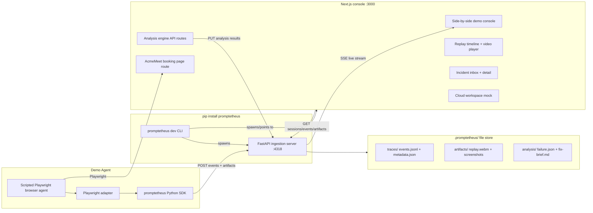

# Technical Architecture

This document defines the concrete system architecture for the Promptetheus hackathon build: what runs where, how data flows, and the contracts that let parallel workstreams build without stepping on each other.

Companion docs:

- [Components](components.md) — each component's responsibilities and interfaces
- [Implementation Plan](implementation-plan.md) — build order and workstream mapping

## System Overview



Two servers, one file store:

1. **FastAPI ingestion server** ships inside the pip package. It is the only writer to `.promptetheus/`. This keeps the `pip install promptetheus && promptetheus dev` story real: the SDK and local server work with zero Node dependencies for ingestion.
2. **Next.js console** owns all UI and the analysis engine. It never touches the file system directly; it reads and writes through the FastAPI HTTP API.

## Data Flow

### Live demo path

1. The scripted browser agent drives the AcmeMeet booking page via Playwright.
2. The Playwright adapter auto-emits `browser_action`, `dom_snapshot`, and `screenshot` events through the SDK.
3. The SDK's local transport POSTs batched events to the FastAPI server.
4. FastAPI appends events to `traces/<session_id>/events.jsonl` and rebroadcasts them on the SSE stream.
5. The demo console renders the live trace stream and lights up evidence chips as events arrive.
6. On `session.end()`, the agent uploads the screen recording; FastAPI saves it under `artifacts/<session_id>/replay.webm`.
7. The console calls its own analysis engine, which fetches the trace, runs detectors, generates the fix brief, and PUTs results back to FastAPI for storage under `analysis/<session_id>/`.

### Seeded data path

The seed script writes ~87 sessions across 5 incident clusters through the same ingestion API, so seeded and live sessions are indistinguishable to the console.

## Storage Contract

All persistence is plain files under `.promptetheus/`. No database.

```text
.promptetheus/
  traces/
    sess_123/events.jsonl        # one trace event per line
    sess_123/metadata.json       # session id, agent, user_goal, status, labels
  artifacts/
    sess_123/replay.webm        # Playwright-native format; no transcode step
    sess_123/screenshots/
  analysis/
    sess_123/failure.json        # detector output: labels, critical step, confidence
    sess_123/fix-brief.md        # generated root cause + fix plan + regression test
```

Rules:

- FastAPI is the only writer. The console reads/writes exclusively through HTTP.
- `events.jsonl` is append-only. Event order is the source of truth for the timeline.
- Artifacts are referenced by relative path in events; FastAPI serves them statically.

## Ingestion API Contract

| Method | Path | Purpose |
| --- | --- | --- |
| POST | `/api/traces` | Create session, write `metadata.json` |
| POST | `/api/traces/{id}/events` | Append batched events to `events.jsonl`, rebroadcast on SSE |
| POST | `/api/traces/{id}/artifacts` | Upload replay video / screenshots |
| GET | `/api/sessions` | List sessions with metadata + labels (drives inbox and incident grouping) |
| GET | `/api/traces/{id}/events` | Full event list for replay view |
| GET | `/api/traces/{id}/analysis` | Read stored analysis results |
| PUT | `/api/traces/{id}/analysis` | Console's analysis engine writes results back |
| GET | `/api/stream` | SSE feed of incoming events for the live console |
| GET | `/artifacts/...` | Static artifact serving (video, screenshots) |

The cloud endpoints in [sdk-architecture.md](../sdk-architecture.md) mirror this surface with `/v1/projects/:project_id/...` prefixes; for the hackathon, Cloud is a UI mock and these are not built.

## Integration Surfaces (Generalizability Ladder)

The ingestion API is not just internal plumbing — it is the universal integration surface. Promptetheus works with any agent stack at three levels of convenience:

```text
Level 1: Raw HTTP          any language/framework POSTs schema-conformant
                           JSON to the ingestion endpoints (curl-able)
Level 2: Python SDK        trace.start() + session helpers; batching,
                           spooling, and schema handled for you
Level 3: Adapters          wrap an object you already have and telemetry
                           falls out for free (Playwright now;
                           LangChain/LangGraph next; others later)
```

Design implications:

- The ingestion endpoints validate against the event schema and accept events from anyone — the SDK gets no private API. If a team runs a TypeScript or Go agent, they can integrate at Level 1 today without waiting for an SDK.
- The Playwright adapter is the flagship Level 3 integration, but it must stay a thin layer over the Level 2 session API — no adapter-only event types or server behavior.
- Documenting Level 1 with a `curl` quickstart is a State 1 item in [staged-scope.md](staged-scope.md); the endpoint design supports it from day one.

## Event Schema Contract

The trace event schema is the single contract shared by all components:

- Defined once as Python TypedDicts in `promptetheus/schema.py` (source of truth).
- Mirrored as zod schemas in `apps/console/src/lib/schema.ts`.
- Event types: `user_message`, `agent_message`, `tool_call`, `tool_result`, `retrieval`, `browser_action`, `dom_snapshot`, `screenshot`, `replay_artifact`, `goal_check`, `state_change` (see [sdk-architecture.md](../sdk-architecture.md)).
- Every event carries: `type`, `session_id`, `timestamp` (ISO 8601), `seq` (monotonic int per session), plus type-specific fields.
- `replay_artifact` carries `event_time_map` so the replay UI can sync the timeline to video timestamps.

The schema is locked in Hour 0-2 before any parallel work begins. Schema changes after the lock require updating both definitions in the same change.

## Target Repo Layout

```text
promptetheus/
  packages/promptetheus/        # pip package: SDK + adapters + FastAPI server + CLI
    promptetheus/
      trace.py                  # trace.start(), Session event helpers
      schema.py                 # TypedDict event definitions (source of truth)
      transport/                # local (HTTP -> FastAPI) + cloud stub
      adapters/playwright.py    # auto-instrumentation for Playwright pages
      server/                   # FastAPI ingestion app
      cli.py                    # promptetheus dev
  apps/console/                 # Next.js: demo console, replay, incidents, cloud mock, AcmeMeet, analysis engine
  agents/browser-agent/         # scripted failing Playwright agent
  scripts/seed.py               # incident cluster seeder
  docs/                         # planning docs (this folder)
  start.md
```

## Prior Art: Why Not Build on the LangSmith SDK?

We evaluated building on top of the [LangSmith SDK](https://github.com/langchain-ai/langsmith-sdk) (MIT licensed, Python + TS clients for the LangSmith tracing platform). Decision: **do not build on it; borrow its patterns.**

Why not:

- **Wrong event model.** LangSmith traces LLM *run trees* (chains, LLM calls, retrievers). Promptetheus's differentiated events — `browser_action`, `dom_snapshot`, `replay_artifact` with screen recordings, `goal_check`, behavioral failure labels — have no home in LangSmith's schema. We would be fighting the data model from hour one.
- **Wrong backend coupling.** The LangSmith client is built to talk to LangSmith Cloud. Repointing it at our local FastAPI server means reimplementing their API surface, which is far more work than our 9-endpoint ingestion contract.
- **Pitch dilution.** The positioning ([product-strategy.md](../product-strategy.md)) is "debugging infrastructure for whatever agent stack you already use." Building *on* a competitor's client muddies that, whereas building an *adapter for* LangChain/LangSmith-instrumented apps strengthens it.

What we borrow:

- **Ergonomics:** LangSmith's `@traceable` decorator and `wrap_openai` patterns are the gold standard for drop-in instrumentation. Our Playwright adapter should feel the same: wrap the object the developer already has, get telemetry for free.
- **Transport design:** background-thread batching, bounded queues, and local spooling on delivery failure — the same resilience model our local/cloud transports specify.
- **Interop path (post-hackathon):** a LangChain/LangSmith adapter that converts their run-tree callbacks into Promptetheus trace events, listed as "should build" in [sdk-architecture.md](../sdk-architecture.md). OpenTelemetry GenAI semantic conventions are the other interop surface worth tracking for cloud ingestion later.

## Non-Goals (Hackathon)

- No database, queue, or streaming infra — files and SSE only.
- No real auth or multi-tenancy — Cloud is a UI mock.
- No real GitHub App — PR preview is generated, optionally a real PR if time allows.
- See "Do Not Build" in [build-plan.md](../build-plan.md).
